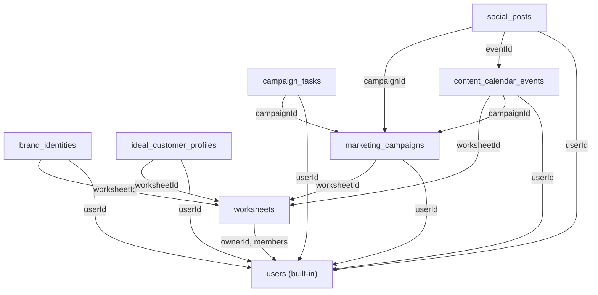

# PocketBase Fresh Database Migration — Walkthrough

## Migration Files

### Migration 1: `1739613560_initial_collections.go` — Initial Schema
[1739613560_initial_collections.go](../migrations/1739613560_initial_collections.go) — creates 7 collections in dependency order.

### Migration 2: `1771148112_add_missing_fields.go` — Add Missing Fields
[1771148112_add_missing_fields.go](../migrations/1771148112_add_missing_fields.go) — adds missing fields to match the full schema spec.

---

## Collection Dependency Graph

---

## Full Schema Reference

### 1. `worksheets` — Không gian làm việc
| Field | Type | Notes |
|-------|------|-------|
| `id` | string (PK) | Auto-generated |
| `ownerId` | relation → users | Required, CascadeDelete |
| `members` | relation → users[] | Unlimited |
| `title` | text (max 500) | Required |
| `content` | JSON | |
| `created` | autodate | onCreate |
| `updated` | autodate | onCreate + onUpdate |

### 2. `brand_identities` — Nhận diện thương hiệu
| Field | Type | Notes |
|-------|------|-------|
| `id` | string (PK) | Auto-generated |
| `worksheetId` | relation → worksheets | Required, CascadeDelete |
| `userId` | relation → users | |
| `brandName` | text (max 300) | Required |
| `slogan` | text (max 500) | |
| `missionStatement` | text (max 5000) | |
| `keywords` | JSON (array\<string\>) | |
| `colorPalette` | JSON (array\<hex\>) | |
| `logoUrl` | URL | |
| `created` | autodate | onCreate |
| `updated` | autodate | onCreate + onUpdate |

### 3. `ideal_customer_profiles` — Chân dung khách hàng
| Field | Type | Notes |
|-------|------|-------|
| `id` | string (PK) | Auto-generated |
| `worksheetId` | relation → worksheets | Required, CascadeDelete |
| `userId` | relation → users | |
| `personaName` | text (max 300) | Required |
| `summary` | text (max 5000) | |
| `demographics` | JSON (object) | |
| `psychographics` | JSON (object) | |
| `goalsAndMotivations` | JSON (array\<string\>) | |
| `painPointsAndChallenges` | JSON (array\<string\>) | |
| `painPoints` | JSON *(legacy)* | From migration 1 |
| `created` | autodate | onCreate |
| `updated` | autodate | onCreate + onUpdate |

### 4. `marketing_campaigns` — Chiến dịch tiếp thị
| Field | Type | Notes |
|-------|------|-------|
| `id` | string (PK) | Auto-generated |
| `worksheetId` | relation → worksheets | Required, CascadeDelete |
| `userId` | relation → users | |
| `name` | text (max 500) | Required |
| `goal` | text (max 2000) | |
| `acquisitionStrategy` | text (max 5000) | |
| `positioning` | text (max 5000) | |
| `valueProposition` | text (max 5000) | |
| `toneOfVoice` | text (max 2000) | |
| `created` | autodate | onCreate |
| `updated` | autodate | onCreate + onUpdate |

### 5. `campaign_tasks` — Nhiệm vụ chiến dịch
| Field | Type | Notes |
|-------|------|-------|
| `id` | string (PK) | Auto-generated |
| `campaignId` | relation → marketing_campaigns | Required, CascadeDelete |
| `userId` | relation → users | |
| `taskName` | text (max 500) | Required |
| `description` | text (max 5000) | |
| `week` | number | 1–4 |
| `status` | select | To Do, In Progress, Done, Cancelled |
| `created` | autodate | onCreate |
| `updated` | autodate | onCreate + onUpdate |

### 6. `content_calendar_events` — Sự kiện lịch nội dung
| Field | Type | Notes |
|-------|------|-------|
| `id` | string (PK) | Auto-generated |
| `worksheetId` | relation → worksheets | |
| `campaignId` | relation → marketing_campaigns | Required, CascadeDelete |
| `userId` | relation → users | |
| `title` | text (max 500) | Required |
| `description` | text (max 5000) | |
| `eventDate` | date | |
| `eventType` | select | Holiday, Trending Topic, Cultural Event, Brand Milestone |
| `aiAnalysis` | text (max 10000) | |
| `contentSuggestion` | text (max 10000) | |
| `socialPostIds` | JSON (array\<string\>) | |
| `created` | autodate | onCreate |
| `updated` | autodate | onCreate + onUpdate |

### 7. `social_posts` — Bài đăng mạng xã hội
| Field | Type | Notes |
|-------|------|-------|
| `id` | string (PK) | Auto-generated |
| `campaignId` | relation → marketing_campaigns | Required, CascadeDelete |
| `eventId` | relation → content_calendar_events | |
| `userId` | relation → users | |
| `platform` | select | Facebook, LinkedIn, Instagram, Twitter, TikTok, YouTube, Other |
| `content` | text (max 10000) | |
| `seoTitle` | text (max 300) | |
| `seoDescription` | text (max 500) | |
| `imageUrl` | URL | |
| `created` | autodate | onCreate |
| `updated` | autodate | onCreate + onUpdate |

---

## Key Design Decisions
- All relations use `CascadeDelete: true` (deleting a parent deletes children)
- API rules require authentication (`@request.auth.id != ''`)
- Worksheets enforce owner-only update/delete
- `AutodateField` for `created`/`updated` on every collection
- `userId` added to all sub-collections for tracking who created each record
- `down` function reverts in reverse dependency order

## Verification Results

| Check | Result |
|-------|--------|
| `go build .` | ✅ Compiled successfully |
| `go run main.go serve` | ✅ Server started, all migrations applied |
| Migration 1 recorded in `_migrations` | ✅ `1739613560_initial_collections.go` |
| Migration 2 recorded in `_migrations` | ✅ `1771148112_add_missing_fields.go` |
| Server accessible at `http://127.0.0.1:8090` | ✅ Running |
